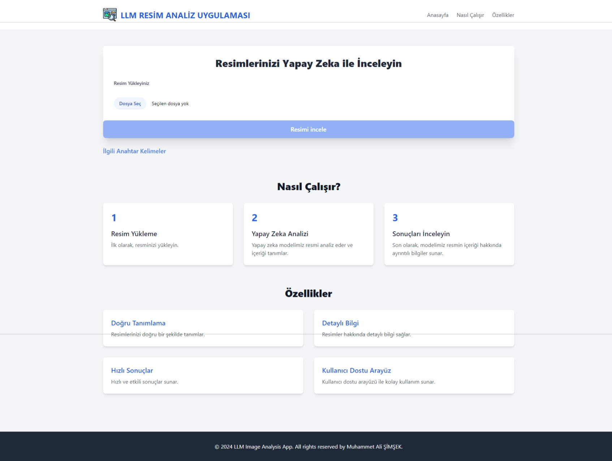

# LLM Image Analysis App

This project is a Next.js application that allows users to upload images, which are then analyzed using Google Generative AI (Gemini model). The app identifies the uploaded image and provides a detailed description in Turkish, along with related questions and keywords.

<div style="display: flex; justify-content: center;">
    
</div>

## Features

- **Image Upload**: Upload any image for analysis.
- **AI-Powered Image Analysis**: Utilizes Google Generative AI to analyze images and generate descriptions.
- **Detailed Insights**: Get image descriptions with important information and context in Turkish.
- **Related Questions & Keywords**: Automatically generates related questions and keywords based on the image description.
- **User-Friendly Interface**: Responsive and easy-to-use UI.

## Tech Stack

- **Frontend**: React with Next.js
- **Backend**: Google Generative AI (Gemini model)
- **Styling**: Tailwind CSS

## Requirements

- Node.js 14+ installed on your machine.
- A valid Google Generative AI API Key (Gemini model).
- Next.js and other dependencies (listed in `package.json`).

## Installation

1. **Clone the Repository**:
    ```bash
    git clone https://github.com/MSimsek07/llm_image_analysis.git
    cd llm_image_analysis
    ```

2. **Install Dependencies**:
    ```bash
    npm install
    ```

3. **Set Up Environment Variables**:
    Create a `.env.local` file at the root of the project with the following content:
    ```bash
    NEXT_PUBLIC_GOOGLE_GEMINI_API_KEY=your_google_gemini_api_key
    ```

4. **Run the Application**:
    ```bash
    npm run dev
    ```

    The app will be running locally at `http://localhost:3000`.

## Usage

1. Open the application in your browser at `http://localhost:3000`.
2. Upload an image using the upload button.
3. The app will analyze the image, providing a detailed description in Turkish, along with related keywords and questions.

### Example Usage

1. Click "Dosya Seç" and select an image file.
2. Click "Resimi İncele" and wait for the AI to process the image.
3. View the generated description, keywords, and related questions.
4. You can click the related keywords and questions to regenerate the output.

## Code Overview

### Main Components

- `MainContainer`: The main component responsible for handling the image upload, analysis, and displaying the results.
    - **State Management**: Uses React's `useState` to manage the uploaded image, result, keywords, related questions, and loading state.
    - **Image Upload**: The `handleImageUpload` function handles file input and stores the uploaded image in the state.
    - **Image Analysis**: The `identifyImage` function sends the image to the Google Generative AI for processing, then handles the response and updates the state.

### Important Scripts

- `main-container.tsx`: The primary logic for uploading and analyzing the image, along with rendering the UI.
- Tailwind CSS is used for styling components and providing a responsive layout.

## Project Structure

```
llm_image_analysis/
│
├── public/                     # Public assets (images, logos, etc.)
├── app/ 
│   ├── fonts/                  # Fonts used by the app
│   ├── layout.tsx              # Layout component
│   └── page.tsx                # Main Next.js page
│
├── components/                 # React components
│   ├── main-container.tsx      # Main image analysis logic
│   ├── footer.tsx              # Footer component
│   └── header.tsx              # Header component
│
├── .env.local                  # Environment variables (not included in repo)
├── package.json                # Project dependencies and scripts
└── README.md                   # Project documentation
```

## Dependencies

- **React**
- **Next.js**
- **Tailwind CSS**
- **Google Generative AI SDK**


## Contributing

Contributions are welcome! Feel free to open issues or submit pull requests.

## License

This project is licensed under the MIT License. See the [LICENSE](LICENSE) file for more details.

## Contact

Created by [Muhammet Ali Şimşek](https://github.com/MSimsek07). Feel free to reach out if you have any questions or suggestions.
